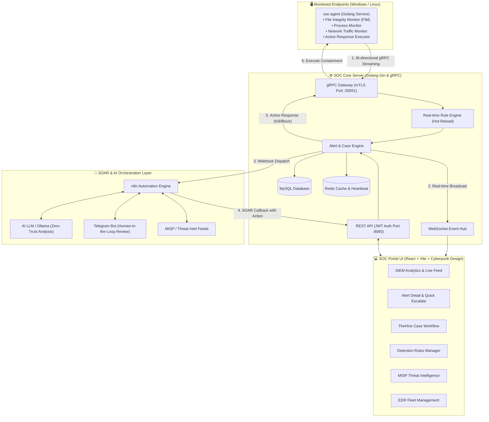

# 🛡️ HỆ THỐNG GIÁM SÁT & PHẢN ỨNG TỰ ĐỘNG SOC / SOAR UNIFIED PLATFORM
> **ĐỒ ÁN TỐT NGHIỆP — CHUYÊN NGÀNH AN TOÀN THÔNG TIN / CÔNG NGHỆ THÔNG TIN**  
> *Nền tảng tích hợp toàn diện SIEM (Giám sát & Phát hiện) + SOAR (Tự động hóa phản ứng) + EDR Agent (Phản ứng tích cực trên Endpoint) + Trí tuệ nhân tạo (AI Zero-Trust & Phê duyệt Human-in-the-Loop)*

---

## 📑 Mục lục
1. [Giới thiệu tổng quan](#-giới-thiệu-tổng-quan)
2. [Kiến trúc hệ thống](#-kiến-trúc-hệ-thống)
3. [Các phân hệ chính](#-các-phân-hệ-chính)
   - [1. Trung tâm điều phối & Xử lý (soc-server)](#1-trung-tâm-điều-phối--xử-lý-soc-server)
   - [2. Tác tử giám sát & phản ứng Endpoint (soc-agent)](#2-tác-tử-giám-sát--phản-ứng-endpoint-soc-agent)
   - [3. Giao diện quản trị Cyberpunk SOC Portal (soc-frontend)](#3-giao-diện-quản-trị-cyberpunk-soc-portal-soc-frontend)
   - [4. Kịch bản điều phối SOAR & AI (n8n + Ollama + Telegram HITL)](#4-kịch-bản-điều-phối-soar--ai-n8n--ollama--telegram-hitl)
4. [Công nghệ sử dụng](#-công-nghệ-sử-dụng)
5. [Cấu trúc thư mục dự án](#-cấu-trúc-thư-mục-dự-án)
6. [Hướng dẫn cài đặt & Chạy hệ thống](#-hướng-dẫn-cài-đặt--chạy-hệ-thống)
   - [Yêu cầu môi trường](#yêu-cầu-môi-trường)
   - [Khởi chạy Backend (soc-server)](#bước-1-khởi-chạy-soc-server)
   - [Khởi chạy Frontend (soc-frontend)](#bước-2-khởi-chạy-soc-frontend)
   - [Triển khai Agent trên Endpoint (soc-agent)](#bước-3-triển-khai-soc-agent-trên-máy-nạn-nhânendpoint)
   - [Cấu hình n8n SOAR Workflow](#bước-4-cấu-hình-n8n-soar-workflow)
7. [Kịch bản kiểm thử thực tế](#-kịch-bản-kiểm-thử-thực-tế)
8. [Tác giả & Đồ án](#-tác-giả--đồ-án)

---

## 🌟 Giới thiệu tổng quan

Trong các trung tâm giám sát an ninh mạng (SOC) truyền thống, quy trình từ lúc **phát hiện sự cố (SIEM)** đến khi **điều tra (Threat Intel/TheHive)** và **cô lập mối đe dọa (EDR/Firewall)** thường bị rời rạc, đòi hỏi nhiều thao tác thủ công và phụ thuộc hoàn toàn vào chuyên viên phân tích bậc 1 (Tier 1 SOC Analyst).

Dự án này xây dựng một **Nền tảng SOC / SOAR Hợp nhất (Unified SOC & SOAR Platform)** khép kín:
* 📡 **Thu thập & Giám sát thời gian thực:** Thu thập sự kiện (FIM, Process, Network, Syslog) từ các Endpoint thông qua luồng kênh truyền nhị phân bảo mật **gRPC mTLS**.
* ⚡ **Bộ quy tắc phát hiện động (Rule Engine):** Đánh giá sự kiện theo thời gian thực (Real-time Evaluation), ánh xạ chuẩn khung **MITRE ATT&CK**, hỗ trợ hot-reload và quản lý quy tắc trực tiếp từ Web UI.
* 🤖 **Tự động hóa SOAR & Trợ lý AI Zero-Trust:** Tích hợp n8n workflow kết hợp mô hình ngôn ngữ lớn (LLM / Ollama) để đánh giá độ tin cậy và tự động đưa ra quyết định xử lý.
* 👨‍💻 **Phê duyệt Human-in-the-Loop (HITL):** Gửi cảnh báo tương tác qua **Telegram Bot**, cho phép chuyên viên phê duyệt chặn tức thì chỉ với một chạm.
* 🎯 **Phản ứng tích cực (Active Response):** Truyền ngược lệnh từ Server xuống Agent qua kênh gRPC để **Kill Process độc hại**, **Khóa IP qua Firewall (iptables/netsh)**, hoặc **Cô lập URL**.

---

## 🏗️ Kiến trúc hệ thống



---

## 🧩 Các phân hệ chính

### 1. Trung tâm điều phối & Xử lý (`soc-server`)
* **Kiến trúc hiệu năng cao:** Viết bằng Golang, sử dụng Gin Web Framework và gRPC.
* **Kênh truyền bảo mật mTLS:** Endpoint Agent kết nối liên tục 2 chiều với Server qua gRPC stream, mã hóa bằng chứng chỉ số Mutual TLS.
* **Rule Engine thời gian thực:** Lưu trữ quy tắc trong Database với khả năng Seed tự động từ file YAML, hỗ trợ toán tử: `equals`, `contains`, `regex`, `in`, `gt`, `lt`. Hot-reload ngay khi cập nhật trên UI mà không cần restart server.
* **Quản lý Vòng đời Sự cố:** Chuyển đổi linh hoạt từ Alert sang Case (Incident), ghi nhận toàn bộ lịch sử can thiệp vào `audit_logs`.
* **Kênh thông báo WebSocket:** Bắn sự kiện tức thời xuống Dashboard ngay mili-giây khi sự kiện xảy ra.

### 2. Tác tử giám sát & phản ứng Endpoint (`soc-agent`)
* **Chạy nền đa nền tảng:** Hỗ trợ Windows (Windows Service) và Linux (systemd).
* **FIM (File Integrity Monitoring):** Giám sát các thư mục nhạy cảm (`C:\Windows\System32`, `C:\Users\Public`, `/etc/`, `/var/www/`), bắt các sự kiện Create, Modify, Delete, Rename.
* **Active Response Engine:**
  * `KILL_PROCESS`: Ép dừng tiến trình mã độc theo PID.
  * `BLOCK_IP`: Tự động thêm rule Firewall (`netsh advfirewall` trên Windows hoặc `iptables` trên Linux) để drop toàn bộ gói tin từ IP tấn công.
  * `BLOCK_URL`: Chặn truy cập tên miền/đường dẫn lừa đảo.

### 3. Giao diện quản trị Cyberpunk SOC Portal (`soc-frontend`)
* **SIEM Dashboard & Analytics:**
  * Biểu đồ xu hướng tấn công 24 giờ (AreaChart), phân bổ mức độ nghiêm trọng (PieChart), Top 5 Agent bị tấn công nhiều nhất (BarChart).
  * **Real-time Live Alert Feed:** Bảng sự kiện trực tiếp qua WebSocket với hiệu ứng chớp flash khi có alert mới.
  * **Alert Detail Drawer:** Mở nhanh khi click vào Alert, hiển thị thông tin Agent, MITRE Tactic/Technique, JSON Payload có tô màu cú pháp, nút kích hoạt SOAR Playbook và form chuyển Alert thành Case điều tra.
* **Case Management (Phân hệ TheHive):** Quản lý trạng thái vụ việc (`New`, `InProgress`, `Closed`, `Rejected`), gán Analyst phụ trách, xem Timeline tích hợp AI reason & Telegram HITL approver, lưu ghi chú điều tra.
* **Detection Rules Management:** Quản lý toàn bộ Rule phát hiện, cho phép thêm, sửa, xóa, bật/tắt (Toggle) trực tiếp trên Web, import/export mẫu quy tắc YAML.
* **Threat Intelligence & IOCs (MISP):** Quản lý kho chỉ số nguy hại (IP, Domain, Hash, URL), tương thích API `/restSearch` của MISP, phân tích IOC thông minh.
* **Agent Fleet Control:** Quản lý danh sách Endpoint, trạng thái trực tuyến, điều khiển can thiệp từ xa (Kill PID, Block IP).
* **Audit Logs:** Nhật ký kiểm toán bất biến ghi nhận mọi hành vi thủ công và tự động của hệ thống.

### 4. Kịch bản điều phối SOAR & AI (`n8n` + Ollama + Telegram HITL)
* File workflow tích hợp sẵn: `SOC SOAR Unified Platform v9 (DDoS + Phishing + Wazuh + TheHive + MISP + AI)- do an tot nghiep.json`.
* Tự động nhận Webhook từ Server khi có Alert:
  * **DDoS Alert:** Phân tích lưu lượng, đối chiếu Threat Intel → Nếu Critical gửi Telegram xin duyệt chặn IP → Gửi lệnh Callback về Server block IP trên Agent.
  * **Phishing Alert:** Trích xuất URL độc hại, kiểm tra danh sách đen → Báo cáo Telegram.
  * **FIM / Brute Force Alert:** Gửi AI Ollama phân tích ngữ cảnh Zero-Trust → Quyết định tự động hoặc chờ Human duyệt.

---

## 💻 Công nghệ sử dụng

| Phân hệ | Công nghệ / Thư viện chính |
|---|---|
| **Backend** | Go (Golang) 1.22+, Gin Gonic, gRPC, Protobuf, GORM, MySQL 8.0, Redis |
| **Agent** | Go (Golang), gRPC Client, Windows Service API (`golang.org/x/sys/windows/svc`), fsnotify (FIM) |
| **Frontend** | React 18, Vite, Tailwind CSS, Recharts, Lucide React, Axios, WebSocket API |
| **SOAR & AI** | n8n Workflow Engine, Ollama (Llama3 / Mistral LLM), Telegram Bot API, MISP API |
| **Bảo mật** | Mutual TLS (mTLS), JWT Authentication, RBAC, Shared-Secret Callback Header |

---

## 📁 Cấu trúc thư mục dự án

```
DO AN TOT NGHIEP/
├── soc-server/                     # Core Backend Service
│   ├── cmd/server/main.go          # Điểm khởi động Server
│   ├── configs/
│   │   ├── config.yaml             # Cấu hình DB, Redis, gRPC, SOAR Webhooks
│   │   └── rules/*.yaml            # File mẫu các luật phát hiện ban đầu
│   ├── internal/
│   │   ├── agent_grpc/             # Xử lý gRPC Server, Connection Manager, Handlers
│   │   ├── api/                    # REST Router, Middlewares, Handlers (Alert, Case, Rule...)
│   │   ├── generated/proto/        # Mã nguồn sinh ra từ Protobuf
│   │   ├── models/                 # GORM Database Models (Alert, Case, Agent, Rule...)
│   │   ├── rules/                  # Rule Engine & Trình thông dịch đánh giá sự kiện
│   │   └── services/               # Nghiệp vụ: Alert, Case, Rule, SOAR, Threat Intel, Audit
│   └── pkg/database/               # Khởi tạo kết nối MySQL & Redis
│
├── soc-agent/                      # Endpoint EDR Agent
│   ├── main.go                     # Điểm chạy chính của Agent
│   ├── config.json                 # Cấu hình Server IP, Port gRPC, mTLS certs
│   ├── service_windows.go          # Tích hợp chạy dưới dạng Windows Service
│   ├── collector/                  # Modules thu thập: Process, Network, FIM, Logs
│   └── responder/                  # Modules thực thi phản ứng: Kill Process, Block IP
│
├── soc-frontend/                   # Giao diện Web Cyberpunk
│   ├── src/
│   │   ├── components/             # Components giao diện (AlertDetailDrawer, Badges, Cards)
│   │   ├── pages/                  # Dashboard, Cases, DetectionRules, ThreatIntel, Agents, Audit
│   │   ├── services/api.js         # Axios Client kết nối REST API Server
│   │   └── hooks/                  # Custom Hooks (useWebSocket, useDashboardStats)
│   └── vite.config.js              # Cấu hình Vite & Proxy API
│
└── SOC SOAR Unified Platform v9...json  # File Workflow n8n SOAR
```

---

## 🚀 Hướng dẫn cài đặt & Chạy hệ thống

### Yêu cầu môi trường
* **Hệ điều hành:** Windows 10/11 hoặc Linux (Ubuntu 20.04+)
* **Go (Golang):** >= 1.22
* **Node.js:** >= 20.18 (khuyến nghị 20.19+ hoặc 22.x) & npm
* **MySQL:** >= 8.0 (Tạo sẵn Database `soc_db` với user `root`, pass `root` hoặc chỉnh trong `config.yaml`)
* **Redis:** >= 6.0 (chạy tại `localhost:6379`)

---

### Bước 1: Khởi chạy `soc-server`

1. Mở Terminal tại thư mục `soc-server`:
   ```powershell
   cd "d:\DO AN TOT NGHIEP\soc-server"
   ```
2. Cập nhật các gói phụ thuộc (nếu cần):
   ```powershell
   go mod tidy
   ```
3. Chạy Server:
   ```powershell
   go run ./cmd/server/main.go
   ```
   * Server sẽ tự động chạy AutoMigrate database, nạp các Rule YAML vào DB, khởi động gRPC mTLS trên cổng `:50051`, WebSocket `/ws/alerts`, và REST API trên cổng `:8080`.

---

### Bước 2: Khởi chạy `soc-frontend`

1. Mở Terminal mới tại thư mục `soc-frontend`:
   ```powershell
   cd "d:\DO AN TOT NGHIEP\soc-frontend"
   ```
2. Cài đặt thư viện:
   ```powershell
   npm install
   ```
3. Khởi động Web Portal:
   ```powershell
   npm run dev
   ```
4. Truy cập trình duyệt tại: **`http://localhost:5173`**
   * *Tài khoản mặc định:* `admin` / `admin123` (hoặc `analyst` / `analyst123`)

---

### Bước 3: Triển khai `soc-agent` trên máy nạn nhân/Endpoint

#### Cách 1: Chạy trực tiếp (Testing mode)
```powershell
cd "d:\DO AN TOT NGHIEP\soc-agent"
go run main.go -config config.json
```

#### Cách 2: Biên dịch và chạy nền như Windows Service
1. Build ra file thực thi ẩn console:
   ```powershell
   go build -ldflags "-H=windowsgui" -o soc-agent.exe .
   ```
2. Cài đặt và kích hoạt dịch vụ chạy nền vĩnh viễn:
   ```powershell
   .\soc-agent.exe -service install
   .\soc-agent.exe -service start
   ```

---

### Bước 4: Cấu hình n8n SOAR Workflow

1. Mở n8n Portal (`http://localhost:5678`).
2. Chọn **Import from File** → Chọn file `SOC SOAR Unified Platform v9 (DDoS + Phishing + Wazuh + TheHive + MISP + AI)- do an tot nghiep.json`.
3. Điền cấu hình Telegram Bot Token & Chat ID trong node Telegram.
4. Kích hoạt (Activate) Workflow.

---

## 🧪 Kịch bản kiểm thử thực tế

### Kịch bản 1: Kiểm thử File Integrity Monitoring (FIM)
Tạo, chỉnh sửa hoặc xóa file trong thư mục giám sát trên máy có Agent:
```powershell
# Chạy trên máy Endpoint
New-Item -ItemType Directory "C:\Users\Public\SOC-Test" -Force
Set-Content "C:\Users\Public\SOC-Test\test.txt" "alert test payload"
Add-Content "C:\Users\Public\SOC-Test\test.txt" "suspicious modification"
Remove-Item "C:\Users\Public\SOC-Test\test.txt"
```
* **Kết quả:** Ngay lập tức trên Dashboard Web, một Alert mức độ **High/Medium** xuất hiện trong bảng Live Feed thông qua WebSocket mà không cần reload trang.

### Kịch bản 2: Xem chi tiết Alert & Escalate sang Case
1. Click vào bất kỳ dòng Alert nào trên Dashboard.
2. Drawer **Alert Details** xuất hiện từ bên phải.
3. Xem thông tin MITRE ATT&CK, Raw JSON Payload.
4. Chuyển sang tab **🛡️ Escalate Case Form** → Nhấn **Confirm Escalation**.
5. Mở trang **Case Management** để xem Case mới tạo với đầy đủ timeline điều tra.

### Kịch bản 3: Tự động hóa SOAR & Phản ứng tích cực (Active Response)
1. Trong Alert Drawer, nhấn nút **⚡ Trigger SOAR (n8n/AI)**.
2. Alert được bắn sang n8n → n8n phân tích AI và gửi tin nhắn về Telegram của quản trị viên kèm 2 nút: `[✅ Chấp thuận chặn IP]` và `[❌ Bỏ qua]`.
3. Khi nhấn Chấp thuận trên Telegram → n8n gọi Callback về `soc-server` → Server đẩy lệnh `BLOCK_IP` qua gRPC xuống Agent → Agent chặn IP thành công bằng Firewall.

---

## 👨‍🎓 Tác giả & Đồ án

* **Đề tài:** Nghiên cứu, thiết kế và xây dựng Hệ thống Giám sát & Phản ứng An ninh mạng Tự động (SOC / SOAR Unified Platform).
* **Sinh viên thực hiện:** Nguyễn Hữu Trí
* **Chuyên ngành:** An toàn Thông tin / Công nghệ Thông tin
* **Repository:** [tringuyenbmt123/do-an-tot-nghiep](https://github.com/tringuyenbmt123/do-an-tot-nghiep)
